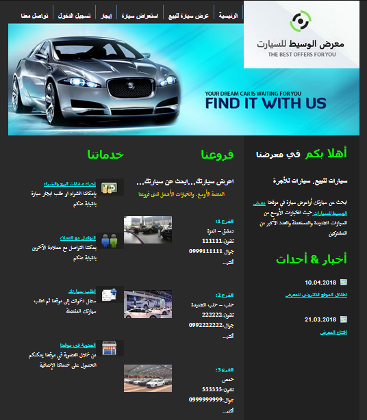
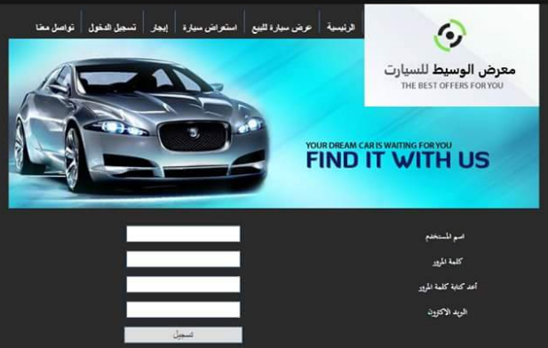
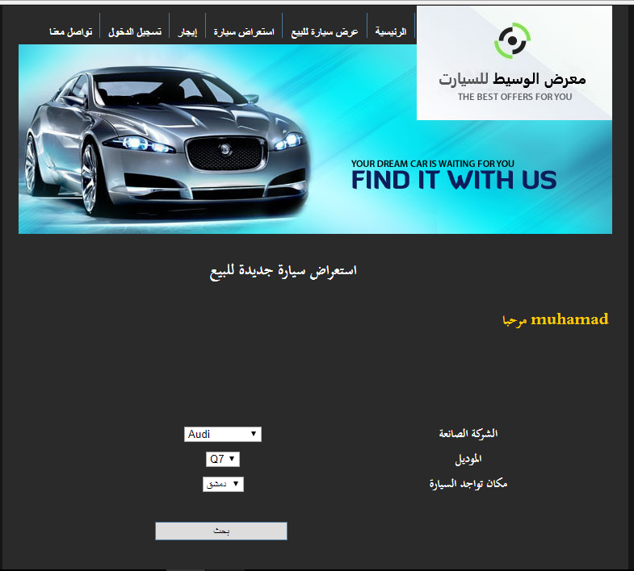

# 🚗 Car Online – Web Application

### 🎓 University Project I (PR1) | March 2018

A web platform for car sales and rentals, developed using:

- 🖥️ **Backend**: ASP.NET with C# and SQL Server  
- 🎨 **Frontend**: HTML5, CSS3, DevExpress UI components

---

## 🔍 Features

- Visitors can browse and search cars listed for sale or rent
- Users can post listings with images and detailed car information
- Contact details are **only visible to registered users**
- Account creation encourages user engagement and ensures privacy

---

## 📸 Screenshots

### 🏠 Home Page

### 📝 User Registration Page

### 👤 Registered User View

---

## ⚙️ Technologies Used

- ASP.NET (C#)
- SQL Server
- HTML5 / CSS3
- DevExpress Components

---

## 📂 Repository

🔗 [GitHub – CarOnline](https://github.com/mohammed-salloum/CarOnline)

---

## 📌 Notes

This project was developed as part of the graduation requirements at the Faculty of Informatics Engineering. It simulates a real-world platform for managing car sales and rentals, with features commonly found in automotive e-commerce systems.

---

## 👨‍💻 Author

**Mohammed Salloum**  
Full-Stack Web Developer | Django & React Specialist  
📧 mohammed.e.salloum@gmail.com  
🔗 [LinkedIn – mohammed-salloum-dev](https://linkedin.com/in/mohammed-salloum-dev)
