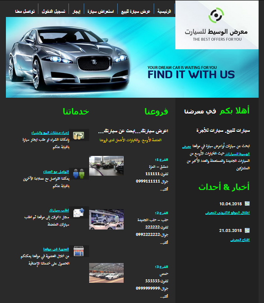
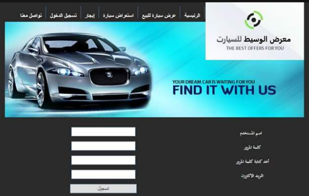
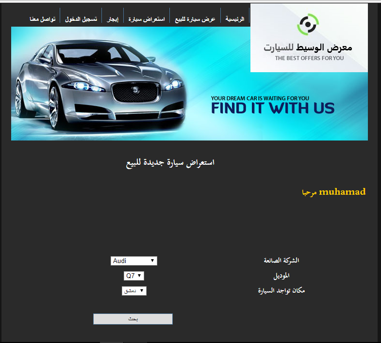

# 🚗 Car Online – Web Application

### 🎓 University Project I (PR1) | March 2018

CarOnline is a full-stack web platform for car sales and rentals, developed as part of a university graduation project. The system allows users to list vehicles for sale or rent and browse listings with advanced privacy controls.

---

## 🔧 Tech Stack

- 🖥️ **Backend**: ASP.NET (C#), SQL Server  
- 🎨 **Frontend**: HTML5, CSS3, DevExpress UI components
  
---
## 🌟 Features

- 🔎 Browse and search cars listed for sale or rent  
- 📝 Users can post listings with images and detailed car information  
- 🔐 Contact details are only visible to registered users  
- 🧾 Encourages account creation and protects user privacy    

---

## 📸 Screenshots

### 🏠 Home Page  

### 📝 User Registration Page  

### 👤 Registered User View  

---

## 📂 Repository

Full source code and project files available here:

[🔗 CarOnline — GitHub Repository](https://github.com/mohammed-salloum/CarOnline)

---

## 👨‍💻 Author

**Mohammed Salloum**  
Front-End React Developer  

📧 Email: mohammed.e.salloum@gmail.com  
🔗 LinkedIn: https://linkedin.com/in/mohammed-salloum-dev